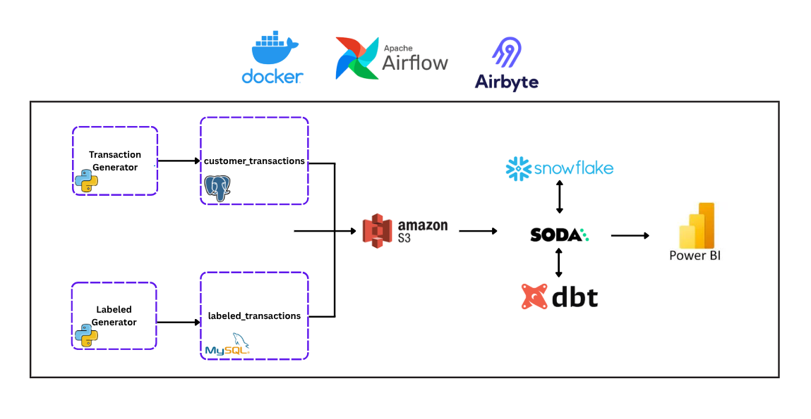

# 🛡️ Fraud Detection Data Pipeline ( ELT )

This project implements a **modern data pipeline** for fraud detection using multiple tools in the Data Engineering ecosystem.  
It simulates real-world data ingestion, transformation, storage, and visualization for fraud analytics.

---

## 📊 Architecture Overview



---

## ⚙️ Tech Stack

- **Docker** → Containerization for reproducible environments  
- **Airbyte** → Data ingestion from multiple sources  
- **Apache Airflow** → Orchestration and scheduling of data workflows  
- **PostgreSQL & MySQL** → Source transactional databases  
- **Amazon S3** → Centralized data lake storage  
- **Snowflake** → Cloud Data Warehouse for analytics  
- **dbt (Data Build Tool)** → Data transformation & modeling  
- **Soda** → Data quality & testing framework  
- **Power BI** → Dashboarding and business intelligence  

---

## 🚀 Workflow

1. **Data Generation**  
   - Python scripts simulate `customer_transactions` and `labeled_transactions`.  
   - Data is stored in **PostgreSQL** and **MySQL**.  

2. **Ingestion & Storage**  
   - **Airbyte** extracts data from PostgreSQL/MySQL.  
   - Data is loaded into **Amazon S3** (Data Lake).  

3. **Data Warehousing**  
   - Data from S3 is loaded into **Snowflake**.  
   - **dbt** transforms raw data into analytics-ready models.  
   - **Soda** validates data quality.  

4. **Analytics & Visualization**  
   - Processed data is visualized in **Power BI** for fraud detection insights.  

---

## 🛠️ Getting Started

Clone this repository and run the pipeline using **Docker Compose**:

```bash
git clone https://github.com/<your-username>/fraud-detection-pipeline.git
cd fraud-detection-pipeline
docker-compose up
```

## 🛡️ License
This project is licensed under the MIT License. You are free to use, modify, and share this project with proper attribution.

## 🌟 About Me
Hi there! I'm Mohamed. A Data Engineer trainee at ITI with hands-on experience in data pipelines, warehousing, and big data tools. Passionate about turning data into insights and growing my technical skills.


Let's stay in touch! Feel free to connect with me on the following platforms:  
[](mailto:mo.badr.ismail@gmail.com)
[](https://www.linkedin.com/in/mbi162/)
